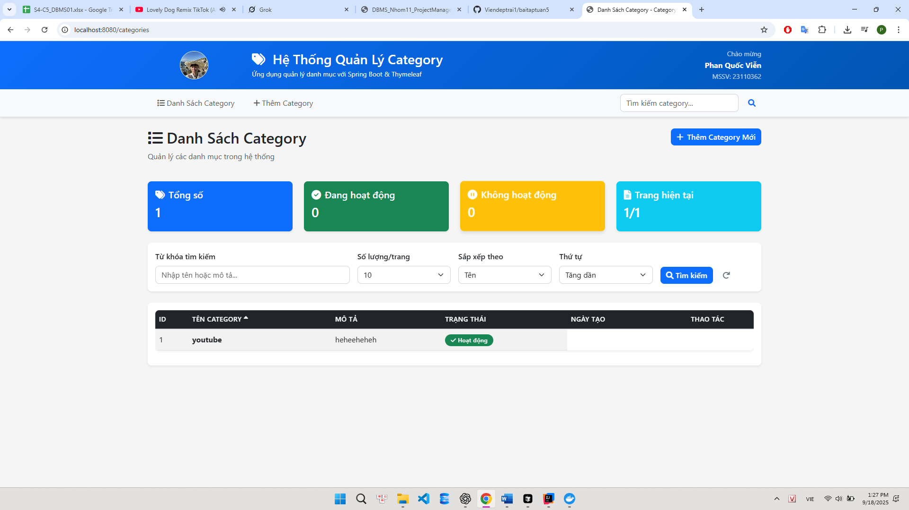

# Category Management System

Ứng dụng quản lý danh mục được phát triển bằng Spring Boot và Thymeleaf.



## Thông tin sinh viên
- **Họ tên:** Phan Quốc Viễn
- **MSSV:** 23110362
- **Lớp:** Lap trinh Web_ Nhom 02_CT3_CT4_A112

## Công nghệ sử dụng
- **Backend:** Spring Boot 3.5.5, Spring Data JPA
- **Frontend:** Thymeleaf, Bootstrap 5, Font Awesome
- **Database:** PostgreSQL 17 (Docker)
- **Build Tool:** Maven

## Tính năng chính
- ✅ **CRUD Category:** Thêm, sửa, xóa, xem chi tiết
- 🔍 **Tìm kiếm:** Tìm theo tên và mô tả
- 📄 **Phân trang:** Hiển thị danh sách có phân trang
- 🎨 **UI đẹp:** Giao diện responsive với Bootstrap
- 🔄 **Soft Delete:** Vô hiệu hóa/kích hoạt category

## Cài đặt và chạy

### 1. Yêu cầu hệ thống
- Java 17+
- Docker & Docker Compose
- Maven

### 2. Khởi động PostgreSQL
```bash
docker-compose up -d
```

### 3. Chạy ứng dụng
```bash
./mvnw spring-boot:run
```

### 4. Truy cập ứng dụng
Mở trình duyệt và truy cập: `http://localhost:8080`

## Cấu trúc dự án
```
src/main/
├── java/com/vienphan/baitaptuan5/
│   ├── entity/          # Entity classes
│   ├── repository/      # Data repositories  
│   ├── service/         # Business logic
│   └── controller/      # Web controllers
└── resources/
    ├── templates/       # Thymeleaf templates
    ├── static/          # CSS, JS, images
    └── application.properties
```

## Database Schema
- **categories**: id, name, description, active, created_at, updated_at

---
*Bài tập tuần 5 - Lập trình Java*
